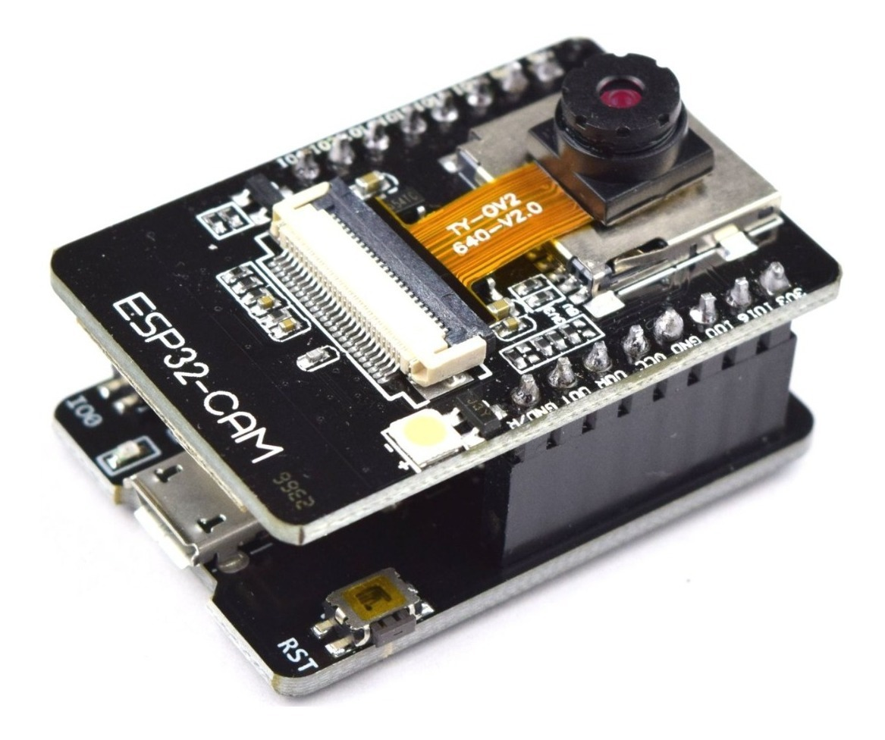
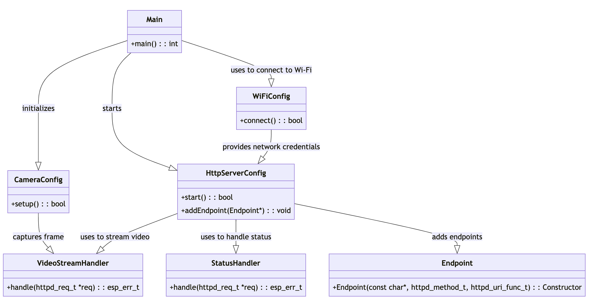

# ESP32 Camera Streamer

This application is designed to stream video from an ESP32 camera module to a web server. The video stream can be accessed via the `/stream` path on the server.

## Features

- Streams video from an ESP32 camera module with OV2640 over HTTP.
- Supports the AI Thinker Model, M5STACK PSRAM Model, and M5STACK WITHOUT PSRAM.
- Wi-Fi connectivity.

## Prerequisites

- ESP32 development board with a camera module. 
- Arduino IDE with ESP32 board support installed, or PlatformIO in VSCode or CLion with AI Thinker ESP32-CAM board with Arduino framework.
- A Wi-Fi network.

## Setup

1. Clone this repository to your local machine.
2. Open the project in your IDE.
3. Each time the ESP32 is powered on, it starts an access point named "AutoConnectAP" and goes into a blocking loop awaiting configuration. The access point is password protected with the password "12345678". You can connect to this access point and configure the Wi-Fi credentials.
5. Compile and upload the sketch to your ESP32 board.

## Usage

Once the sketch is uploaded and the ESP32 board is powered on, it will connect to the specified Wi-Fi network and start the camera server. The video stream can be accessed by navigating to `http://<ESP32_IP_ADDRESS>/stream` in a web browser, where `<ESP32_IP_ADDRESS>` is the IP address of the ESP32 board on your Wi-Fi network.

## Implementation Details

The application is implemented in C++ and uses the ESP32 Camera library to capture video frames from the ESP32 camera module. The video frames are then streamed over HTTP using the ESP HTTP Server library. The application is designed using a class-based approach, with the main components of the application encapsulated in classes:

- **Camera Initialization:** The camera is initialized with the `esp_camera_init()` function, which is called in the `setup()` function in `main.cpp`. The camera configuration is set in the `camera_config_t` struct.
- **Wi-Fi Connection:** Each time the ESP32 is powered on, it creates an access point named "AutoConnectAP". You can connect to this access point and configure the Wi-Fi credentials. This is handled by the `WiFiManager` library.
- **HTTP Server:** The HTTP server is started in the `startCameraServer()` function in `app_httpd.cpp`. The server listens on two ports, one for the web server and one for the stream server.
- **Stream Handler:** The `VideoStreamHandler` class in `VideoStreamHandler.cpp` handles HTTP GET requests to the `/stream` path. It captures a frame from the camera, converts it to JPEG format if necessary, and sends it as a chunk of the HTTP response. The handler also calculates the average frame time for the video stream.
- **Running Average Filter:** A running average filter is implemented in `VideoStreamHandler.cpp` to calculate the average frame time for the video stream. The filter is used in the `handle()` function.



The application is built with PlatformIO and the Arduino framework for the ESP32. The `platformio.ini` file contains the configuration for the PlatformIO environment, including the board type (`esp32cam`) and the framework (`arduino`). The application is designed to be run on an ESP32 development board with a camera module. It has been tested with the AI Thinker Model, M5STACK PSRAM Model, and M5STACK WITHOUT PSRAM. The pin configuration for the camera module is set in `main.cpp` based on the selected camera model.

## Troubleshooting

### Serial Monitor

You may encounter issues when trying to view the application logs in the Serial Monitor. As a workaround, you can use the `screen` command in the terminal to connect to the ESP32's serial port. For example:

```bash
screen /dev/tty.usbserial-1210 115200
```

Where `/dev/tty.usbserial-1210` is the device name and `115200` is the baud rate.  

### Identifying the Connected Device
To identify which device the ESP32 is connected to, you can use the `ls /dev/tty.*` command in the terminal. This command will list all tty devices, including your ESP32 if it's connected. The ESP32 device name usually starts with `/dev/tty.usbserial-` followed by a series of numbers and letters.

```bash
ls /dev/tty.*
```